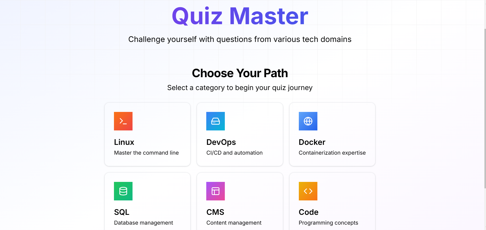

# Quiz App

A modern, interactive quiz application built with **Next.js**, **React**, and **TypeScript**. Test your knowledge across various categories, track your progress, and compete on the leaderboard!

# Screenshots




 <!-- Add a screenshot of your app here -->

## Table of Contents

1. [Features](#features)
2. [Setup Instructions](#setup-instructions)
   - [Prerequisites](#prerequisites)
   - [Installation](#installation)
3. [Project Structure](#project-structure)
4. [Usage Instructions](#usage-instructions)
5. [API Routes Documentation](#api-routes-documentation)
6. [Deployment Instructions](#deployment-instructions)
7. [Contributing](#contributing)
8. [License](#license)
9. [Acknowledgements](#acknowledgements)

---

## Features

- **Multiple Quiz Categories**: Choose from a variety of topics like Linux, DevOps, and more.
- **Interactive UI**: Smooth animations and a clean, user-friendly interface.
- **Real-Time Progress Tracking**: Track your score and time remaining during the quiz.
- **Leaderboard**: Submit your score and see how you rank against others.
- **Confetti Celebration**: Celebrate when you score above 70%!

---

## Setup Instructions

### Prerequisites

- Node.js (v18 or higher)
- npm or yarn
- MongoDB (for leaderboard functionality)

### Installation

1. **Clone the repository:**

   ```bash
   git clone https://github.com/your-username/quiz-app.git
   cd quiz-app
   ```

2. **Install dependencies:**

   ```bash
   npm install
   # or
   yarn install
   ```

3. **Set up environment variables:**

   Create a `.env.local` file in the root directory and add the following variables:

   ```env
   MONGODB_URI=mongodb://localhost:27017/quiz-app
   NEXT_PUBLIC_API_URL=http://localhost:3000/api
   NEXT_PUBLIC_QUIZ_API_KEY=YOUR_API_KEY
   ```

4. **Run the development server:**

   ```bash
   npm run dev
   # or
   yarn dev
   ```

5. **Open the app in your browser:**

   Visit `http://localhost:3000` to view the application.

---

## Project Structure

```
quiz-app/
├── public/               # Static assets (images, fonts, etc.)
├── src/
│   ├── app/              # Next.js app router (pages and layouts)
│   ├── components/       # Reusable UI components
│   ├── types/            # TypeScript type definitions
│   ├── models/           # Database models (e.g., Leaderboard)
│   ├── api/              # API routes
│   ├── styles/           # Global styles and CSS modules
│   └── utils/            # Utility functions and helpers
├── .env.local            # Environment variables
├── next.config.js        # Next.js configuration
├── package.json          # Project dependencies and scripts
└── README.md             # Project documentation
```

---

## Usage Instructions

1. **Start the Quiz:**
   - Select a category from the homepage.
   - Click "Start Quiz" to begin.

2. **Answer Questions:**
   - Read each question carefully.
   - Select the correct answers using checkboxes.
   - Click "Submit Answer" to proceed.

3. **Track Progress:**
   - View your score and time remaining in real-time.
   - Use the "Previous" and "Next" buttons to navigate between questions.

4. **View Results:**
   - After completing the quiz, see your score and percentage.
   - Submit your name to the leaderboard.

5. **Leaderboard:**
   - Check the leaderboard to see how you rank against others.

---

## API Routes Documentation

### 1. **Fetch Quiz Questions**

- **Endpoint:** `/api/quiz`
- **Method:** `GET`
- **Query Parameters:**
  - `category`: The quiz category (e.g., `Linux`, `DevOps`).
  - `limit`: The number of questions to fetch (default: `10`).
- **Response:**
  ```json
  [
    {
      "question": "What is the Linux command to list files?",
      "answers": {
        "answer_a": "ls",
        "answer_b": "dir",
        "answer_c": "list",
        "answer_d": null
      },
      "correct_answers": {
        "answer_a_correct": "true",
        "answer_b_correct": "false",
        "answer_c_correct": "false",
        "answer_d_correct": "false"
      }
    }
  ]
  ```

### 2. **Submit Score to Leaderboard**

- **Endpoint:** `/api/leaderboard`
- **Method:** `POST`
- **Request Body:**
  ```json
  {
    "name": "John Doe",
    "score": 8,
    "category": "Linux",
    "timeTaken": 120
  }
  ```
- **Response:**
  ```json
  {
    "message": "Score submitted successfully!"
  }
  ```

### 3. **Fetch Leaderboard**

- **Endpoint:** `/api/leaderboard`
- **Method:** `GET`
- **Query Parameters:**
  - `category`: The quiz category (e.g., `Linux`, `DevOps`).
- **Response:**
  ```json
  [
    {
      "name": "John Doe",
      "score": 8,
      "timeTaken": 120
    }
  ]
  ```

---

## Deployment Instructions

### Vercel (Recommended)

1. Install the Vercel CLI:

   ```bash
   npm install -g vercel
   ```

2. Deploy the app:

   ```bash
   vercel
   ```

3. Follow the prompts to complete the deployment.

### Other Platforms

You can deploy this app to any platform that supports Next.js, such as:

- **Netlify**
- **AWS Amplify**
- **Heroku**

---

## Contributing

We welcome contributions! Here's how you can help:

1. **Fork the repository.**
2. **Create a new branch:**
   ```bash
   git checkout -b feature/your-feature-name
   ```
3. **Commit your changes:**
   ```bash
   git commit -m "Add your message here"
   ```
4. **Push to the branch:**
   ```bash
   git push origin feature/your-feature-name
   ```
5. **Submit a pull request.**

Please ensure your code follows the project's coding standards and includes tests where applicable.

---

## License

This project is licensed under the **MIT License**. See the [LICENSE](LICENSE) file for details.

---

## Acknowledgements

### Third-Party Services and Libraries

- **[Next.js](https://nextjs.org/)** - React framework for server-rendered applications.
- **[React](https://reactjs.org/)** - JavaScript library for building user interfaces.
- **[TypeScript](https://www.typescriptlang.org/)** - Typed superset of JavaScript.
- **[MongoDB](https://www.mongodb.com/)** - NoSQL database for storing leaderboard data.
- **[canvas-confetti](https://www.kirilv.com/canvas-confetti/)** - For celebratory confetti animations.
- **[Lucide Icons](https://lucide.dev/)** - Beautiful and consistent icons.
- **[Tailwind CSS](https://tailwindcss.com/)** - Utility-first CSS framework.

### Special Thanks

- The **QuizAPI** for providing quiz questions.
- The **Next.js community** for their excellent documentation and support.

---

